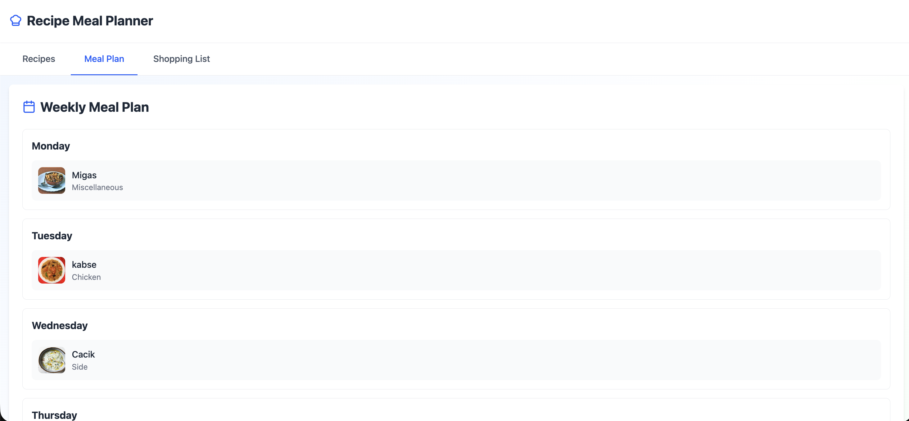
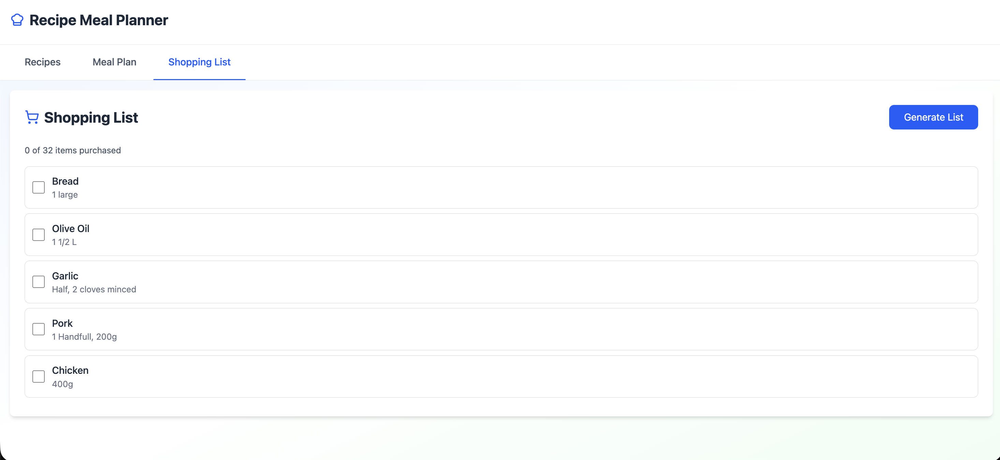
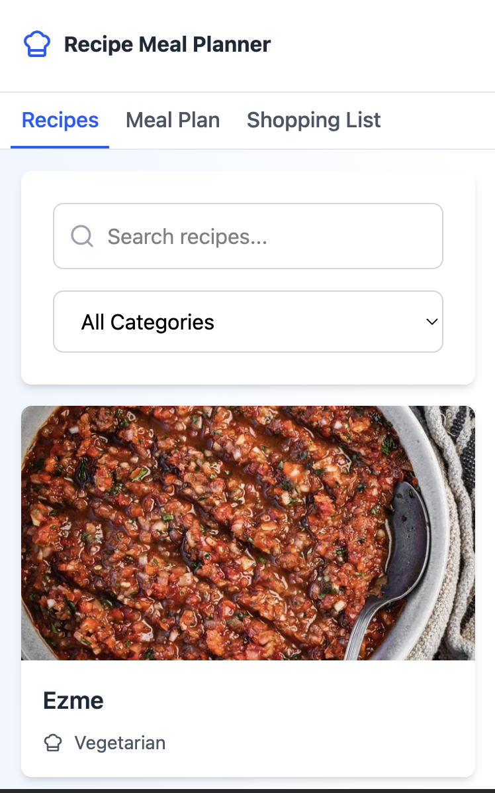

# Meal Planner App

## Setup & Run

### 1. Prerequisites

- **Node.js**: v18 or higher recommended.
- **Package Manager**: npm or yarn.

### 2. Installation Steps

Clone the repository and install dependencies:

```bash
npm install
```

### 3. Environment Variables

Currently, the app uses the public [TheMealDB API](https://www.themealdb.com/api.php) and does not require any private environment variables for the default setup.

- **API URL**: `https://www.themealdb.com/api/json/v1/1` (configured in `src/constants/index.ts`)

### 4. How to Run the Project

Start the development server:

```bash
npm run dev
```

The app will be available at `http://localhost:5173` (or the port shown in your terminal).

---

## Architecture Overview

### 1. Folder Structure

The project follows a scalable **Atomic Design** structure within `src/components`:

- **`atoms`**: Basic building blocks (buttons, inputs, icons).
- **`molecules`**: Simple combinations of atoms (search bars, card headers).
- **`organisms`**: Complex UI sections (recipe cards, navigation bars).
- **`modules`**: Feature-specific containers (RecipeList, MealPlanView).
- **`Layout`**: Global layout wrappers.

Other key directories:

- **`src/context/redux`**: Redux Toolkit setup for global state management.
- **`src/hooks`**: Custom React hooks for logic encapsulation.
- **`src/services`**: API service layer using RTK Query / Fetch.
- **`src/types`**: TypeScript definitions for type safety.

### 2. State Management

- **Redux Toolkit (RTK)**: Used for managing global application state.
  - **Why**: To maintain a single source of truth for the **Meal Plan** and **Recipe Data**, ensuring that changes in one part of the app (e.g., adding a recipe to the plan) are immediately reflected elsewhere (e.g., shopping list).
  - **Slices**: Located in `src/context/redux/features`, separating concerns like `recipe` data.

### 3. Custom Hooks

- **`useRecipes` / `useRecipeDetails`**: Encapsulate data fetching logic, keeping components clean.
- **`useMealPlan`**: Manages the core logic for the weekly meal plan (add, remove, reorder).
- **`useApi`**: A generic hook to standardize API requests and handle loading/error states consistently.

---

## Technical Decisions

### 1. Libraries & Patterns

- **React 19 & Vite**: Chosen for the latest features (Server Components support ready, though client-side here) and lightning-fast development server.
- **TypeScript**: Essential for maintainability and catching errors early in a logic-heavy app like a meal planner.
- **Redux Toolkit**: Simplifies Redux boilerplate and includes **RTK Query** for efficient data fetching and caching.
- **Tailwind CSS**: Enables rapid UI development with a utility-first approach, making it easy to build a responsive design.
- **Atomic Design**: Ensures components are reusable and the UI remains consistent.

### 2. Trade-offs

- **Redux vs. Context**: Redux was chosen over Context API to prevent unnecessary re-renders and provide better dev tooling, even though it adds slightly more initial complexity.
- **Atomic Design**: Requires more initial thought to categorize components but pays off significantly as the application grows.

### 3. Future Improvements

- **Persistence**: Save the meal plan to `localStorage` or a backend database so data isn't lost on refresh.
- **Authentication**: Allow users to save their own plans.

---

## Time Breakdown

| Task              | Time Spent     |
| ----------------- | -------------- |
| Setup & structure | 40 min         |
| Custom hooks      | 60 min         |
| State management  | 45 min         |
| UI components     | 270 min        |
| API integration   | 30 min         |
| Testing & fixes   | 60 min         |
| **Total**         | **~8.5 hours** |

---

## Challenges Faced

### 1. State Synchronization

Keeping the "Add to Meal Plan" button state in sync with the actual meal plan across different views (Recipe List vs. Details) was tricky.

- **Solution**: utilized Redux selectors to derive the "added" state directly from the global store, ensuring immediate UI updates.

---

## Screenshots

### 1. Recipe Search/Browse Page


### 2. Recipe Details View


### 3. Weekly Meal Plan



### 4. Shopping List



### 5. Mobile Responsive View


